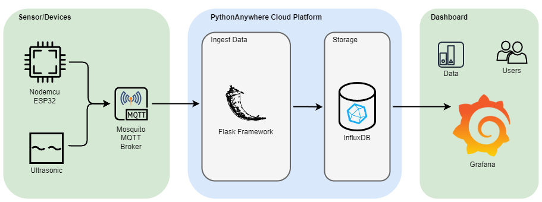

# Flood Sentry
### Software Engineering (SEEL4213)
#### Group: Rampaging Rhinos

  

#### Table of contents

 

[1.0 Problem Statement](#10-problem-statement)

[2.0 System Architecture](#20-system-architecture)

[3.0 Sensor](#30-sensor)

[4.0 Cloud Platform](#40-cloud-platform)
> [4.1 PythonAnywhere](#41-pythonanywhere)
>
> [4.2 Demo Video](#42-demo-video)

[5.0 Dashboard](#50-dashboard)

 

## 1.0 Problem Statement

## 2.0 System Architecture

&nbsp;&nbsp;&nbsp;&nbsp;&nbsp;&nbsp;&nbsp;&nbsp; 

The system architecture consists of a ultrasonic HC-SR04 sensor that sends data to a microcontroller, which is NodeMCU ESP32. It connects to a Mosquitto MQTT broker and send the data via wifi. A Python Flask application run on a server hosted on PythonAnywhere subscribes to the MQTT broker, receives the data and stores it to an InfluxDB database. Grafana reads the data from InfluxDB database and visualize it in real-time dashboards. The dashboard is accessible to user via a public URL that is hosted on the PythonAnywhere cloud platform.

## 3.0 Sensor 

## 4.0 Cloud Platform

#### 4.1 PythonAnywhere
PythonAnywhere allows users to write and run Python code in the cloud, which is particularly useful for IoT projects that require a persistent and reliable connection. Additionally, PythonAnywhere provides a range of pre-installed libraries and packages, including those for IoT-related tasks such as data processing and visualization. It also has support for many popular IoT hardware devices, making it easy to interface with sensors and other devices. Finally, PythonAnywhere offers a simple user interface making it easy to manage and deploy IoT applications. 

#### 4.2 Demo Video
&nbsp;&nbsp;&nbsp;&nbsp;&nbsp;&nbsp;&nbsp;&nbsp; 

Porting flask app from stage 1 to PythonAnywhere 

## 5.0 Dashboard
